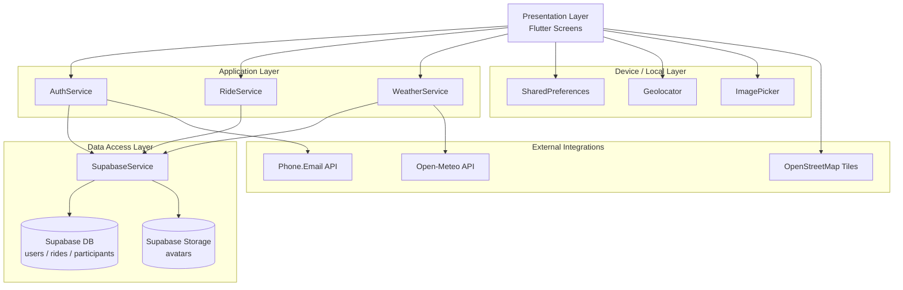

<div align="center">
  <h1>
    
    JourneySync
  </h1>

  <h2>Tech Stack</h2>

  <p>
    
    
    
    
    
    
    
    
    
    
    
    
    
    
  </p>

  <p>A production-oriented group ride coordination and rider safety app for motorcycle communities.</p>
</div>

---

## At a Glance

JourneySync is built to solve the full rider journey in one app:

- Fast account onboarding with phone verification
- Group ride creation and nearby ride discovery
- Live ride context with continuous location sync
- SOS-first safety workflow for emergencies

This repository contains a Flutter client with Supabase-backed data and storage integration.

## Product Scope

JourneySync is designed around three product pillars:

1. Reliable onboarding and identity continuity
2. Smooth planning and joining of group rides
3. Safety-focused live ride and emergency response features

## Core Capabilities

| Capability | What it does | Key implementation |
|---|---|---|
| Authentication | New/existing account phone-based sign in | `phone_email_auth`, `auth_service.dart` |
| Session persistence | Keeps user logged in with local session cache | `shared_preferences` |
| Profile management | Name, bike, avatar upload, account preferences | `settings_screen.dart`, Supabase storage |
| Ride creation | Publishes ride with start/end context | `create_ride_screen.dart`, `ride_service.dart` |
| Nearby discovery | Finds and joins nearby active rides | `nearby_rides_screen.dart` |
| Live map | Streams ride markers and user location | `map_screen.dart`, `flutter_map` |
| Live ride mode | GPS sync, ride status updates, in-ride context | `live_ride_screen.dart` |
| SOS workflow | Sends emergency alert context to ride | `sos_alert_screen.dart` |
| Ride summary | End-of-ride completion snapshot | `ride_summary_screen.dart` |
| Weather context | Displays current local weather on home screen | `weather_service.dart`, Open-Meteo |

## User Flows

### New Rider Flow

1. Launch app -> splash initializes dependencies.
2. Choose `New Account` in login.
3. Enter rider profile (name + bike).
4. Verify phone number.
5. User profile is created/resolved in Supabase.
6. Session is cached locally and user lands on Home.

### Returning Rider Flow

1. Launch app.
2. Splash checks local session (`isLoggedIn`).
3. If session exists -> Home.
4. Otherwise verify phone via `Existing Account` mode.
5. Profile is fetched and session refreshed.

### Ride Lifecycle Flow

1. Creator posts ride (title + destination + current location as start).
2. Creator is auto-added as participant.
3. Nearby riders discover and join.
4. Ride enters active/live mode with location updates.
5. SOS can be raised at any point.
6. Ride is ended and summary is shown.

## System Architecture



## Technology Stack

### Client

- Flutter / Dart (`sdk: ^3.7.2`)
- Material UI with custom stateful screens

### Backend and Data

- Supabase PostgreSQL via `supabase_flutter`
- Supabase Storage for rider avatars

### Authentication

- Phone.Email (`phone_email_auth`) for phone identity verification

### Device and Platform Integrations

- `geolocator` for GPS and live tracking
- `shared_preferences` for local persistence
- `image_picker` for avatar selection

### Mapping and Network

- `flutter_map` + `latlong2`
- OpenStreetMap tile provider
- `http` for weather API calls (Open-Meteo)

## Repository Map

```text
lib/
  main.dart                 # Bootstrap + third-party initialization
  splash_screen.dart        # Startup gate and navigation decision
  login_screen.dart         # New/existing account auth flow
  home_screen.dart          # Dashboard + quick actions + weather
  create_ride_screen.dart   # Ride creation form
  nearby_rides_screen.dart  # Nearby search and join UX
  map_screen.dart           # Live ride markers on map
  ride_lobby_screen.dart    # Lobby-style pre-ride coordination UI
  live_ride_screen.dart     # Active ride state + location sync + SOS entry
  sos_alert_screen.dart     # Emergency alert detail screen
  ride_summary_screen.dart  # End-of-ride summary
  settings_screen.dart      # Profile, preferences, legal, logout

  auth_service.dart         # Identity normalization + session write
  ride_service.dart         # Ride domain operations
  supabase_service.dart     # Supabase data/storage abstraction
  weather_service.dart      # Open-Meteo integration
```

## Backend Model (Public Overview)

JourneySync uses Supabase with three main logical entities:

- `users`: rider profile and account metadata
- `rides`: ride planning, live ride state, and safety context
- `participants`: rider membership in rides

For security and flexibility, implementation-level schema details and local key maps are intentionally kept out of public documentation.

## Quick Start

### Prerequisites

- Flutter SDK (stable)
- Android Studio or VS Code with Flutter tooling
- A Supabase project (DB + optional Storage)
- Phone.Email client credentials

### Install Dependencies

```bash
flutter pub get
```

### Run App

```bash
flutter run
```

## iOS Setup

### Prerequisites

- macOS with Xcode installed
- CocoaPods installed (`sudo gem install cocoapods`)
- Flutter iOS toolchain configured (`flutter doctor`)

### First-Time iOS Commands

```bash
flutter pub get
cd ios
pod install
cd ..
flutter run -d ios
```

### iOS Permission Keys (Already Added)

The following keys are configured in [ios/Runner/Info.plist](ios/Runner/Info.plist):

- `NSLocationWhenInUseUsageDescription`
- `NSPhotoLibraryUsageDescription`
- `NSPhotoLibraryAddUsageDescription`
- `NSCameraUsageDescription`

### App Store / TestFlight Note

For release distribution, open the `Runner` project in Xcode and configure:

- Signing Team
- Bundle Identifier
- Provisioning Profile / Certificates

Then build:

```bash
flutter build ipa
```

### Quality Checks

```bash
flutter analyze
flutter test
```

## Configuration Notes

- Supabase and Phone.Email are initialized in `lib/main.dart` using required `--dart-define` values.
- Required runtime defines:

```bash
flutter run \
  --dart-define=SUPABASE_URL=https://YOUR_PROJECT.supabase.co \
  --dart-define=SUPABASE_ANON_KEY=YOUR_SUPABASE_ANON_KEY \
  --dart-define=PHONE_EMAIL_CLIENT_ID=YOUR_PHONE_EMAIL_CLIENT_ID
```

- Optional avatar bucket override:

```bash
flutter run --dart-define=SUPABASE_AVATAR_BUCKET=avatars
```

### Android Release Signing

1. Copy `android/key.properties.example` to `android/key.properties`.
2. Fill keystore values (`storeFile`, `storePassword`, `keyAlias`, `keyPassword`).
3. Place your keystore file at the configured `storeFile` path.

Then build release:

```bash
flutter build apk \
  --dart-define=SUPABASE_URL=https://YOUR_PROJECT.supabase.co \
  --dart-define=SUPABASE_ANON_KEY=YOUR_SUPABASE_ANON_KEY \
  --dart-define=PHONE_EMAIL_CLIENT_ID=YOUR_PHONE_EMAIL_CLIENT_ID
```

## Security and Production Hardening

- Enforce RLS policies on every table.
- Minimize `anon` role permissions.
- Validate input and constraints at the DB/API layer.
- Avoid committing sensitive keys and tokens to source control.
- Add session expiry and token refresh strategy for production.

For private disclosure, see [SECURITY.md](SECURITY.md).

## Current Limitations

- Some ride screens still reference legacy field names in UI fallbacks.
- Placeholder metrics are displayed where backend values are not available.
- Session gate is currently preference-based and should be reinforced with token validation.

## Planned Improvements

- Unify ride schema usage across all ride-related screens.
- Add real turn-by-turn navigation integration.
- Improve background location handling and battery safety.
- Add push notifications for ride and safety events.
- Add CI pipeline for linting, tests, and release checks.

## Contribution and Governance

- Contribution guide: [CONTRIBUTING.md](CONTRIBUTING.md)
- Community rules: [CODE_OF_CONDUCT.md](CODE_OF_CONDUCT.md)
- Security process: [SECURITY.md](SECURITY.md)
- Project credits: [CREDITS.md](CREDITS.md)

## License

MIT License. See [LICENSE](LICENSE).
