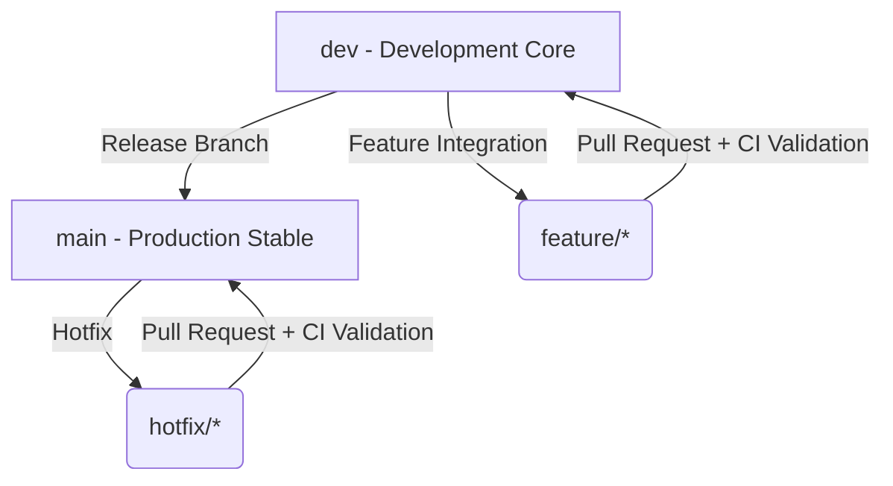

# JourneySync — Production Release Process

This document defines the semantic commit guidelines, branching strategy, versioning rules, and tagging structures for JourneySync to maintain high engineering quality.

---

## 1. Branch Strategy

JourneySync uses a robust, startup-grade branching structure to guarantee codebase stability:



- **`main`**: Production-ready branch. Only accepts merges from `dev` (releases) or `hotfix/*` (production bug fixes). Direct pushes are strictly forbidden.
- **`dev`**: Integration branch for new features and bug fixes. All active development merges here.
- **`feature/*`**: Feature-specific branches created from `dev`. Merged back via Pull Requests after passing CI checks.

---

## 2. Semantic Commit Conventions

JourneySync follows the [Conventional Commits](https://www.conventionalcommits.org/) specification. Every commit message must follow this format:

```text
<type>(<scope>): <description>

[optional body]

[optional footer(s)]
```

### Supported Commit Types:

| Commit Type | Purpose | Example |
|---|---|---|
| **`feat`** | Introducing a new app feature | `feat(live-tracking): add smooth heading arrow` |
| **`fix`** | Resolving a bug or compilation issue | `fix(auth): correct redirect callback mismatch` |
| **`docs`** | Modifying documentation files | `docs(readme): add build status badges` |
| **`style`** | Code formatting (spacing, semi-colons) | `style(marker): run dart format on smooth_marker` |
| **`refactor`** | Restructuring code without changing functionality | `refactor(supabase): clean up duplicate route queries` |
| **`perf`** | Code changes targeting performance improvements | `perf(map): optimize polyline layer rebuilds` |
| **`test`** | Adding or upgrading automated tests | `test(screens): add HomeScreen widget rendering test` |
| **`ci`** | GitHub Actions or pipeline configuration | `ci(actions): add caching for Gradle dependencies` |
| **`chore`** | Upgrading packages or housekeeping tasks | `chore(pubspec): upgrade dependency versions` |

---

## 3. Versioning & Git Tags

JourneySync uses **Semantic Versioning (SemVer)**: `MAJOR.MINOR.PATCH+BUILD`.
- **`MAJOR`**: Significant breaking changes or major feature drops (e.g., `2.0.0`).
- **`MINOR`**: New features/capabilities that are backward-compatible (e.g., `1.1.0`).
- **`PATCH`**: Backward-compatible bug fixes and optimizations (e.g., `1.0.3`).
- **`BUILD`**: Incremented build version for store submission (e.g., `+4`).

### Git Tagging:
Every release merged into `main` must be tagged matching the version in `pubspec.yaml`:
```bash
git tag -a v1.0.2 -m "Release v1.0.2 - Live Rider Tracking & Safety Features"
git push origin v1.0.2
```

---

## 4. Manual Release Process

To create and publish an Android release candidate locally, run the integrated release script:

```powershell
.\scripts\release.ps1 -Version 1.0.2
```

This release command:
1. **Validates** current branch and state.
2. **Updates** the `pubspec.yaml` version.
3. **Builds** the signed release APK (`flutter build apk --release`).
4. **Applies** the SemVer git tag.
5. **Creates** and uploads the release artifact directly to GitHub.
