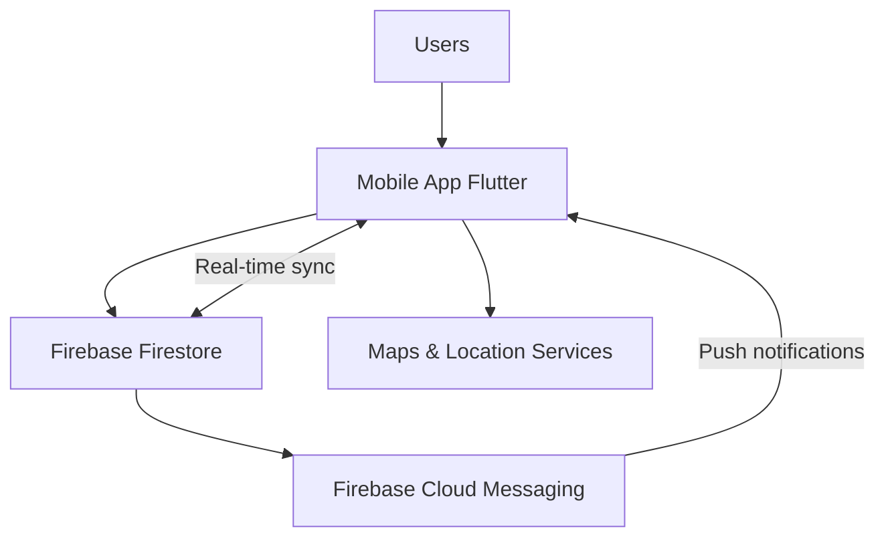

<div align="center">

# 🏍️ JourneySync
Real-Time Motorcycle Ride Coordination & Safety Platform.
Ride Together. Ride Safe.

---

<!-- Badges: Mobile, Web, Backend, Tools -->


---
</div>


## Overview

JourneySync is a lightweight, session-based mobile application focused on real-time coordination and safety for motorcycle group rides. It provides leader-controlled rides, live GPS tracking, emergency alerts, and ride history — optimized for practical group riding scenarios rather than social networking.

This repository contains the landing page and static assets for JourneySync (single-file static site used for marketing and downloads). The mobile app is implemented as a Flutter project (not included here).

---

## Tech Stack

- Mobile: Flutter (Android first)
- Web Landing Page: HTML + Tailwind CSS (CDN) + vanilla JS
- Backend (MVP architecture): Firebase (Firestore + FCM)
- Maps: Google Maps SDK / Fused Location Provider for Android

---

## Problem Statement

Group rides have real problems that standard tools don't address:

- Riders splitting up without visibility
- Poor in-ride coordination and leader controls
- Limited emergency communication for groups
- No simple session-based ride management

JourneySync solves these by offering live, session-scoped tracking and a safety-first feature set.

---

## Core Concepts

- Session-based rides: tracking is enabled only while a ride is active.
- Leader-controlled: ride leaders manage who joins and can end the session.
- Privacy-first: location is visible only to approved ride participants.
- Emergency alerts: in-app emergency signaling that notifies ride participants.

---

## Key Features

1. Ride creation and leader assignment
2. Nearby ride discovery and join requests
3. Live tracking with leader highlight and lag detection
4. Emergency SOS signaling to ride participants
5. Ride history: name, duration, participants, route summary
6. Offline maps (downloadable map tiles)

---

## System Architecture (High-level)



Principles:
- Real-time synchronization via Firestore listeners
- Minimal background processing (only during ride)
- Session-centered data modeling for privacy and ease of cleanup

---

## Conceptual Data Model

Users
- `user_id`
- `phone_number`
- `display_name`
- `active_ride_id`

Rides
- `ride_id`
- `leader_id`
- `destination`
- `status` (open | active | ended)
- `created_at`, `started_at`, `ended_at`

RideParticipants
- `user_id`, `ride_id`, `role` (leader|member)
- `live_latitude`, `live_longitude`
- `alert_status`, `last_updated`

---

## Development & Local Run

This repo contains a single-file landing page at `index.html`. To preview locally:

1. Open `index.html` in your browser (double-click or serve with a static server).

Optional (serve with a simple HTTP server):

```bash
# Python 3
python -m http.server 8000
# then visit http://localhost:8000
```

Notes:
- Landing page is static and uses Tailwind via CDN; no build step required.
- APK and demo video are included under `assets/` for local testing.

---

## Mobile App

- Core implementation: Flutter (Android primary). See mobile repo for full source.
- Location: Use Fused Location Provider with a balanced update interval (5–7s suggested).
- Background tracking: restricted to active rides to reduce battery drain and respect privacy.
- Real-time sync: use Firestore with per-ride documents and participant subcollections.
- Notifications: Firebase Cloud Messaging for critical alerts (SOS) and optional background messages.

---

## Testing Strategy

- Closed beta with local rider groups (Bengaluru pilot)
- Real-world ride simulations with GPS spoofing to validate tracking and reconnection
- SOS stress tests: ensure delivery to participants and UI handling
- Battery & connectivity profiling on typical Android devices

---

## Roadmap (Planned)

Short term:
- Unmute control and poster image for demo video modal on the landing page
- Full keyboard focus-trap for modals (accessibility)
- Poster image and Play/Pause UX improvements

Medium term:
- App Store release (iOS) and App Store readiness work
- Ride scheduling and replay animation
- Verified ride leaders and public rides discovery

Long term:
- Custom backend (WebSockets/Node) for large-scale real-time needs
- Premium analytics and route recommendations

---

## Contribution

This project is currently in closed MVP. If you'd like to contribute or run a local preview of the landing page, open an issue or contact: journeysync.app@gmail.com

---

## Contact

Email: journeysync.app@gmail.com

Location: Bengaluru, India

---

## License

Proprietary for now — contact maintainers for collaboration and licensing.

---

